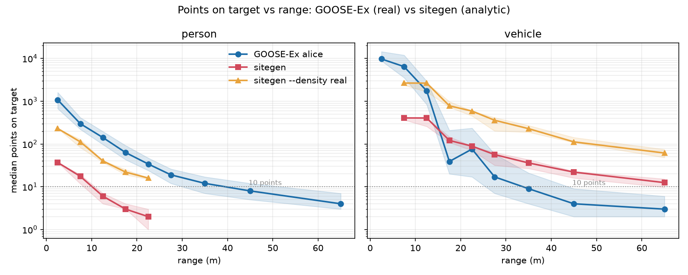

# GOOSE-Ex: sitegen's sensor model, measured against a real excavator

sitegen's README makes a claim it never checked:

> Points on a target fall off as 1/r², range noise grows with distance,
> dropout rises quadratically, and dust eats returns over a region. A worker
> at 14 m gets about 20 points; a truck at 45 m gets a handful.

Every number there was chosen to make clustering fail at an interesting
distance. None of it came from a sensor. This document is what happened when
the same quantities were measured on
[GOOSE-Ex](https://goose-dataset.de/) — a Liebherr R924 tracked excavator
carrying four Ouster scanners, working real landfill, quarry and construction
sites, with 5,000 hand-labelled frames carrying **pointwise class *and*
instance** annotations.

The instance ids are what make the comparison possible. With them you can ask
the only question that decides whether an auto-labeler has anything to work
with — *how many returns land on a person at 20 m* — and get an answer from a
machine that exists.

**The short version: sitegen's falloff *shape* was right for people and wrong
for vehicles, its absolute density was 29× too low, and it under-stated the
ego machine by half.** Four changes came out of that, each one landed and
re-measured separately; [what each one bought](#the-changes-measured-one-at-a-time)
is the table at the end. The ego share and the median return range now match
the real machine to within a point and a factor of two respectively, a worker
at 14 m gets 40 returns against a real 141 under `--density real`, and
intensity carries a class signal where it used to carry a second copy of
range. The vehicle collapse at range is the one that did not close, and the
reason it did not is the interesting part.

## Where the data is

`../data/goose-ex/` — outside this repo, and staying there: GOOSE-Ex is
CC BY-SA 4.0, and ShareAlike would attach to anything derived from it that
this Apache-2.0 repo redistributed. Provenance, URLs, sizes, checksums and the
attribution requirement are recorded in
[`data/goose-ex/SOURCE.md`](../../data/goose-ex/SOURCE.md).

All six official archives were taken, 31.3 GB compressed:

| | train | val | test |
| --- | ---: | ---: | ---: |
| `gooseEx_3d_*.zip` | 9.49 GB | 853 MB | 1.70 GB |
| `gooseEx_2d_*.zip` | 15.36 GB | 1.46 GB | 2.46 GB |

Only 3D is used here. **Test labels are withheld** for the public Codabench
benchmark, so train and val are the measurable set.

## What it contains

5,000 labelled frames — a pointwise-annotated LiDAR cloud paired 1:1 with a
pixel-annotated image — over 100 sequences recorded across Germany in about a
year:

* **2,800 frames from ALICE**, the drive-by-wire Liebherr R924 tracked
  excavator. This is the platform that matters here; a ~24-tonne tracked
  excavator is within a few tonnes of the 20-tonne machine sitegen simulates.
  The loader finds 2,164 train + 192 val + 444 test = 2,800, which is exactly
  the paper's figure — a useful check that nothing is being silently missed.
* **2,200 frames from a Boston Dynamics Spot** quadruped — a different sensor
  height and a different world, ignored below.

By environment: generic 1,560, landfill 1,572, quarry 1,226, construction site
642. Split 3,989 / 407 / 604 train / val / test.

## Sensor facts

### LiDAR

The excavator carries **four Ouster scanners**, and the labelled data ships
only their **merged** cloud:

| | paper (arXiv:2409.18788) | platform docs (goose-dataset.de/docs/alice) |
| --- | --- | --- |
| house-mounted | 3 × Ouster **OS1-64** Rev6 | 3 × Ouster **OS0-64** Rev C |
| boom-mounted | 1 × Ouster **OS1-128** Rev6 | 1 × Ouster **OS0-128** |

**The two sources disagree**, and it matters: OS1 is a 45° vertical FOV /
~120 m sensor, OS0 a 90° / ~50 m one. The data settles it in the paper's
favour — returns reach **104.2 m**, well past any OS0's usable range — so the
OS1 reading is the one used below. Treat the exact model as unresolved.

* **Channels**: 3 × 64 + 1 × 128 = **320 beams** across the rig.
* **Merged cloud rate**: 10 Hz (`/pcl_merging/merged_cloud`). The labelled
  frames are sampled far more sparsely than that — roughly one every 5 s.
* **Mounting**: three on the **house** (cabin), one on the **boom**. The boom
  unit moves with the arm, so its extrinsic is not static; the authors merge
  all four into the **INS/IMU frame** for exactly this reason, which is why
  only a merged cloud is published. Figure 3 of the paper gives sensor heights
  of 0.73–1.26 m *relative to the IMU frame*, on a machine 12.82 m long and
  2.99 m wide.
* **Rotation rate, per-channel elevation pattern**: **not recoverable from
  this release.** Four differently-oriented sensors merged into one frame have
  no single ray pattern, and the paper cites the Ouster datasheet rather than
  quoting figures. Getting a per-scanner elevation pattern means the raw ROS
  bags from <https://goosedb.uni-koblenz.de/>, not the labelled ZIPs.
* **Measured range envelope** (ALICE, 2,164 train frames): median **4.5 m**,
  p99 **18.2 m**, max **104.2 m**; excluding the ego machine's own returns,
  median **5.1 m**, p90 **11.3 m**, p99 **20.7 m**. See the histogram below —
  this sensor spends almost all of itself inside 10 m.
* **Intensity encoding**: raw Ouster **remission**, stored as `float32` but
  valued 0–255 with a long tail. Not normalised, not calibrated, not
  comparable across sensors.

### Cameras

* 2 × **JAI FSFE-3200D** prism cameras — 3.2 MP, **RGB and NIR
  simultaneously**, 6 mm Fujinon lens, 5 Hz, 59° hFOV, front-left on the cabin.
* 4 × **Alvium G1-240C** — 2.4 MP RGB, global shutter, 5 Hz, **110° hFOV**,
  at the cabin corners. sitegen's four-camera `SURROUND_RIG` at the house
  corners turns out to match real practice closely.
* Intrinsics: pinhole + checkerboard, published on `camera_info` in OpenCV
  form. Extrinsics: AprilTag target with three circular holes, matched in both
  cloud and image; recalibrated between recordings, so it drifts slightly.

### Coordinate frames and sync

Everything is expressed relative to the **IMU/INS frame** of an SBG Ekinox-D,
which is also the PTP grandmaster for the whole sensor network at 200 Hz. The
merged cloud's origin therefore sits at the INS, near the machine base and
close to ground level — the clouds bottom out around z ≈ 0 and the ego
machine's own returns rise to z ≈ +7.8 m. No `base_link`-style frame names are
published beyond "IMU frame".

**Every range in this document is measured from that machine-base origin**,
not from a scanner. sitegen measures from its sensor, ~3 m up. At the
distances being compared the discrepancy is under 2%, and machine-relative
range is the more meaningful quantity for a working machine anyway.

### How much of the sweep is the machine itself

**28.0%.** Well over a quarter of every merged sweep is `ego_vehicle` — the
excavator's own house, boom and bucket. It reaches 8.2 m from the origin and
7.8 m up, which is the boom. (25.9% on the val split; 28.0% across the 2,164
train frames.)

sitegen's README used to say "about 12%"; its output before this document was
15.2%, and the real machine is **roughly double that**. It is 27.0% now, and
[the elevation band](#the-changes-measured-one-at-a-time) is what did it. Note the paper's Fig. 2 omits
`ego_vehicle` from its point-cloud statistics — the class is present and
labelled in the data, just excluded from that figure — so this number does not
appear anywhere upstream.

### Label ontology

64 classes, shared unchanged with the original GOOSE dataset, shipped as
`goose_label_mapping.csv` (`class_name,label_key,has_instance,hex`) in every
archive. 36 occur in GOOSE-Ex. Mapped onto sitegen's four:

| sitegen | GOOSE-Ex | key | notes |
| --- | --- | ---: | --- |
| `excavator` | `heavy_machinery` | 57 | no excavator class; also covers loaders, dozers |
| `haul_truck` | `truck`, `trailer` | 34, 37 | `car` (12) is separate |
| `worker` | `person` | 14 | `rider` (32) is separate |
| `grade_stake` | `pole` | 45 | nearest instanced match; not exact |
| terrain | `soil`, `gravel`, `asphalt`, `cobble`, `low_grass` | 31, 24, 23, 3, 50 | a real site is not one material |
| ego | `ego_vehicle` | 8 | |

`has_instance` marks which classes carry instance ids — all the object classes
do, none of the terrain or vegetation classes do.

### File format

SemanticKITTI convention, in two mirrored trees:

```
lidar/<split>/<platform>_scenario<NN>/<...>_pcl.bin      float32 (N,4)  x y z remission
labels/<split>/<platform>_scenario<NN>/<...>_goose.label uint32  (N,)   sem = v & 0xFFFF
                                                                        inst = v >> 16
```

Filenames carry the capture timestamp in nanoseconds, so playback timing is
recoverable. Scenario directories are prefixed `alice_` or `spot_`.

## Running the loader

`tools/goose/` is a standalone uv project — it does not import `sitegen`, and
`sitegen` does not import it.

```sh
cd tools/goose

# The comparison: profile, sweep-level table, and both points-on-target curves.
# --cache pickles the real side, which never changes between sitegen
# configurations and takes a couple of minutes to read; a calibration sweep
# reads 605 M returns once and then runs in seconds.
uv run python compare.py \
    --goose ../../../data/goose-ex/gooseEx_3d_train \
    --scene /tmp/site.mcap --dense /tmp/site_real.mcap \
    --cache /tmp/goose_train.pkl \
    --plot ../../docs/points-on-target.png

# Optional: wrap GOOSE-Ex frames in sitegen's own MCAP contract, so the two
# recordings open in one Foxglove window on one timeline.
uv run python to_mcap.py \
    --goose ../../../data/goose-ex/gooseEx_3d_val \
    --scenario alice_scenario02 --limit 20 --out goose_alice.mcap
```

The sitegen side is generated with:

```sh
uv run sitegen generate --out /tmp/site.mcap      --seed 1 --duration 60
uv run sitegen generate --out /tmp/site_real.mcap --seed 1 --duration 60 \
    --density real
```

`--platform spot` switches to the quadruped; `--limit N` caps the frames read.

`compare.py` reduces both datasets to the same thing — one
`goose.Observation` per instance per frame, carrying a range and a point
count — so the two are compared on identical axes despite arriving by
completely different routes. sitegen knows which box each return came from
because it fired the ray; GOOSE-Ex knows because somebody labelled it.

Points on target are counted **per object, not per part**: sitegen's
articulated excavator is five boxes, but a labeler has to find *the machine*.
The ego machine is excluded from both curves — it is always there, and
proprioception gives it away for free.

## The comparison

**2,164 labelled ALICE frames** (the whole train split, 605 M returns) against
a 60 s sitegen scene at defaults (seed 1, 600 sweeps, 120 truth clouds). The
val split (192 ALICE frames, 51.5 M returns) was run separately and agrees
throughout to within a few percent, so nothing below rests on one scenario.

### Sweep level

The sitegen column was measured twice: once against `--actors boxes`, which is
what existed when this document was first written, and again against the mesh
actors that replaced them in `9b7561c`. Nothing in the sensor changed between
those two columns — only the geometry the rays hit — so the difference is
what the meshes alone did.

| | GOOSE-Ex ALICE | sitegen, boxes | sitegen, meshes | meshes / real |
| --- | ---: | ---: | ---: | ---: |
| returns per sweep | 279,555 | 9,607 | 9,708 | **0.03×** |
| ego machine share | 28.0% | 15.0% | 15.2% | 0.54× |
| median return range | 4.5 m | 14.5 m | 14.4 m | 3.20× |
| p99 return range | 18.2 m | 52.8 m | 52.8 m | 2.89× |
| max return range | 104.2 m | 54.2 m | 53.1 m | 0.51× |

Everything at the sweep level is a wash, which is expected: the ego machine and
the ground are most of a sweep, and neither of those became a mesh. The meshes
show up per object, below.

### Where the returns actually are

| bin | share | cumulative |
| --- | ---: | ---: |
| 0–2 m | 3.40% | 3.40% |
| 2–5 m | 55.93% | 59.33% |
| 5–10 m | 29.82% | **89.15%** |
| 10–15 m | 7.85% | 96.99% |
| 15–20 m | 2.26% | 99.25% |
| 20–30 m | 0.68% | 99.93% |
| 30–40 m | 0.06% | 99.98% |
| 40–60 m | 0.01% | 100.00% |
| 60–120 m | 0.00% | 100.00% |

**89% of a real excavator sweep lands within 10 m**, and 97% within 15 m.
sitegen's median return is at 14.5 m. This is the single largest structural
difference between the two.

### Points on target — person

| range | GOOSE-Ex median (IQR) | n | boxes | meshes | meshes / real |
| --- | ---: | ---: | ---: | ---: | ---: |
| 0–5 m | 1,076 (671–1,609) | 78 | — | — | — |
| 5–10 m | 298 (220–414) | 650 | 38 | 17 | 0.06× |
| 10–15 m | 141 (97–195) | 1,012 | 23 | 12 | **0.08×** |
| 15–20 m | 63 (43–92) | 862 | 12 | 7 | 0.11× |
| 20–25 m | 34 (24–47) | 493 | 5 | 3 | 0.09× |
| 25–30 m | 19 (12–26) | 220 | — | — | — |
| 30–40 m | 12 (7–17) | 364 | — | — | — |
| 40–50 m | 8 (5–12) | 229 | — | — | — |
| 50–80 m | 4 (3–7) | 208 | — | — | — |

4,116 person observations. The ratio is flat across four consecutive bins —
0.13, 0.16, 0.19, 0.15 for boxes and 0.06, 0.08, 0.11, 0.09 for meshes — which
is the whole finding: the curve has the right shape and the wrong scale.

**The meshes halved it.** A person is not a 0.6 × 0.45 m cuboid, and about
half the returns the box worker collected were landing on cuboid that a body
does not fill. The synthetic worker got twice as hard to find, and that is the
honest number rather than a regression.

### Points on target — vehicle

| range | GOOSE-Ex median (IQR) | n | boxes | meshes | meshes / real |
| --- | ---: | ---: | ---: | ---: | ---: |
| 0–5 m | 9,719 (8,758–14,432) | 41 | — | — | — |
| 5–10 m | 6,435 (3,552–11,929) | 436 | 792 | 797 | 0.12× |
| 10–15 m | 1,737 (836–2,945) | 796 | 484 | 816 | 0.47× |
| 15–20 m | 39 (20–208) | 1,572 | 225 | 236 | **6.05×** |
| 20–25 m | 76 (17–235) | 1,431 | 132 | 167 | 2.20× |
| 25–30 m | 17 (7–58) | 1,503 | 108 | 110 | **6.47×** |
| 30–40 m | 9 (4–21) | 1,694 | 70 | 58 | **6.44×** |
| 40–50 m | 4 (2–9) | 779 | 32 | 35 | 8.75× |
| 50–80 m | 3 (2–6) | 1,851 | 20 | 22 | 7.33× |

10,103 vehicle observations.

**Mesh occlusion steepened the vehicle collapse, and nowhere near enough.**
Between the 10–15 m and 40–50 m bins the real data falls **434×**. Boxes fell
15×; meshes fall **23×**, entirely because the near bin gained — a mesh truck
has wheels, a chassis and a tipper body where the box truck was two cuboids,
so it collects 816 returns at 12 m instead of 484, while the far bin barely
moves. Actor-on-actor occlusion is real now and it is worth about a factor of
1.5 out of a factor of 29. The rest is not geometry sitegen has. The real column is not monotonic — the 15–20 m
bin (39) sits below 20–25 m (76) — because which machines are parked at which
distance varies by scenario, and the wide IQRs (20–208, 17–235) say the same
thing: at a given range a real vehicle is either in clear view or mostly
behind something. That bimodality is itself a finding; see below.



### Remission is a class signal, and sitegen used to throw it away

| class | remission mean | median | p95 |
| --- | ---: | ---: | ---: |
| **person** | **62.1** | 28.0 | **243.0** |
| container | 58.6 | 41.0 | 172.0 |
| car | 48.6 | 11.0 | 243.0 |
| building | 29.6 | 23.0 | 78.0 |
| pole | 21.4 | 10.0 | 123.2 |
| tree_trunk | 20.6 | 18.0 | 41.0 |
| ego_vehicle | 20.4 | 9.0 | 100.0 |
| truck | 19.9 | 15.0 | 51.0 |
| heavy_machinery | 19.9 | 15.0 | 50.0 |
| low_grass | 13.5 | 12.0 | 28.0 |
| asphalt | 10.9 | 10.0 | 24.0 |
| **soil** | **8.3** | 7.0 | 20.0 |
| gravel | 7.6 | 7.0 | 18.0 |
| water | 5.6 | 5.0 | 13.0 |

**A person is the brightest class on a construction site** — 7.5× soil on the
mean, 3× the heavy machinery beside them, and a p95 of 243 that pins the top
of the scale. That is hi-vis PPE and retroreflective banding doing exactly
what it was designed to do, and poles (grade stakes, p95 123) show the same
signature for the same reason. Note the medians are far below the means:
these distributions are heavily right-skewed, because a return is only bright
when it lands on the retroreflective band rather than the fabric.

These six rows are now `sensors.REMISSION`, a median and a p95 per class; see
[Intensity is now a class signal](#intensity-is-now-a-class-signal).

## What sitegen gets right, and what it gets wrong

This section is the finding as it stood before anything was changed. What
each change then bought is [the table below](#the-changes-measured-one-at-a-time);
the headline is that four of the six recommendations landed, one turned out to
be a coupling bug rather than a parameter, and one was declined on the
evidence.

**Right: the 1/r² falloff, for people.** This is the load-bearing claim and it
survives almost exactly. Real person counts fall 298 → 8 between the 5–10 m and
40–50 m bins, a factor of **37.3** across a 6× range increase; pure 1/r²
predicts **36×**. And the ratio column for people is flat across four
consecutive bins — 0.13, 0.16, 0.19, 0.15 for boxes, 0.06, 0.08, 0.11, 0.09
for meshes — meaning the curve has the right shape and only the wrong scale.
sitegen is uniformly too sparse on people, not wrongly shaped.

**Right: the ego machine is a real problem, and the README under-sells it.**
"About 12%" was conservative; a real excavator-mounted rig spends **28.0%** of
every sweep on itself. Masking it from proprioception is even more valuable
than sitegen claims.

**Right: the surround camera rig.** Four cameras at the house corners is what
ALICE actually does, with 110° lenses.

**Wrong: absolute density, by 29×.** 9,708 returns against 279,555. Nothing
about a 14,400-ray sensor resembles a 320-beam four-scanner rig, and this
propagates into every point-count claim. "A worker at 14 m gets about 20
points" was the README's headline number; measured on the meshes it is 12, and
the real figure is **141**.

**Wrong: the range distribution.** 89% of a real sweep is inside 10 m; sitegen
puts its median return at 14.4 m. sitegen's narrow −25°…+5° elevation band
aims most beams near the horizon, where they travel until they hit something
far away or nothing at all. A real rig with wide vertical coverage, mounted
low on a machine standing in a pit, dumps most of its beams into the ground
within a few metres.

**Wrong: vehicle falloff at range, badly.** Real vehicle counts collapse
1,737 → 4 between the 10–15 m and 40–50 m bins — a factor of **434** where
1/r² predicts **13**, leaving a factor of ~33 unexplained by geometry.
sitegen holds 58 points on a truck at 30–40 m where reality gives 9, and its
`--difficulty` dropout term (`0.35 × (r/60)²`, just 12% at 35 m) is nowhere
near steep enough to close that. Part of this is honest scene difference —
real distant machines sit behind spoil piles and other machines, and any
instance labelled at all at 50 m is by construction one of the barely-visible
ones, while sitegen's single truck is unoccluded on flat ground. But that *is*
the finding: **beyond ~15 m occlusion dominates 1/r².** Meshes brought
actor-on-actor occlusion, which moved the collapse from 15× to 23×, and 23× of
434× is the measurement of how much of this a sensor parameter was never going
to reach. The real IQRs say it outright — 17–235 points at 20–25 m is not noise
around a mean, it is two populations, one in clear view and one mostly hidden.

**Wrong: intensity carries no information.** sitegen computed intensity as
`1 − r/max_range` — a pure function of range, identical for a worker's vest
and the dirt behind them. In reality a person returns 7.5× the mean remission
of soil and 3× that of the machine beside them. sitegen's README observes that
"geometry finds the worker and cannot name the machine"; on real data,
*intensity alone* very nearly names the worker, and the synthetic data cannot
express that at all.

## The changes, measured one at a time

Every row below is a full 60 s scene on seed 1 with mesh actors, re-measured
through `compare.py` against the same 2,164 real frames. Changes are
cumulative down the table, and each one landed on its own so that the
statistic it bought is attributable to it rather than to the set.

| | pts/sweep | ego% | median range | person @10–15 m | vehicle 10–15 → 40–50 | file |
| --- | ---: | ---: | ---: | ---: | ---: | ---: |
| **real GOOSE-Ex** | **279,555** | **28.0%** | **4.5 m** | **141** | **1,737 → 4 = 434×** | — |
| before (−25…+5°, 60 m) | 9,708 | 15.2% | 14.4 m | 12 | 816 → 35 = 23× | 86.9 MB |
| 1. elevation −45…+15° | 9,830 | **27.0%** | **8.6 m** | 6 | 406 → 22 = 18× | 88.1 MB |
| 2. `max_range` 100 m | 10,033 | 26.4% | 8.8 m | 6 | 408 → 25 = 16× | 89.6 MB |
| 3. dropout quoted at 60 m | 9,831 | 27.0% | 8.6 m | 6 | 405 → 22 = 18× | 89.9 MB |
| 4. per-class intensity | 9,831 | 27.0% | 8.6 m | 6 | 405 → 22 = 18× | 89.9 MB |
| **`--density real`** | **63,488** | **26.5%** | **8.8 m** | **40** | 2,649 → 112 = 24× | 590.3 MB |

**1. The elevation band is the change that mattered**, and it bought two
independent statistics at once, exactly as predicted: the ego share went
15.2% → **27.0%** against a real 28.0%, and the median return fell
14.4 m → **8.6 m** against a real 4.5 m. Both from aiming the beams where a
rig mounted on a machine standing in a pit actually aims them. It cost person
density — a worker at 10–15 m halved, 12 → 6 — because the same 14,400 rays
now cover twice the vertical angle, which is what the ray budget is for.

**2. `max_range` 60 → 100 m** does almost nothing at the default budget —
nothing in the scene is more than 57 m from the machine at 14,400 rays — and
something real at `--density real`, where the p99 return went 56.7 m → 79.6 m:
the far ground plane starts existing. What it also did was quietly cut
far-field dropout by two thirds, which is (3), and which pulls that p99 back
to 61.0 m in the shipped configuration.

**3. Dropout is now quoted at a fixed 60 m** rather than as a fraction of
`max_range`. The term was `0.35 × (r/max_range)²`, so raising the range from
60 m to 100 m took dropout at 45 m from 20% to 7% — a degradation silently
weakening behind an unrelated change. Whether a return survives 45 m of air is
a fact about 45 m, so `dropout_range_m` now holds it there; the curve is
identical to the pre-calibration one at every distance, which is the point.
It is visible in the table as row 3 undoing row 2's drift.

**4. Per-class intensity moves no geometry at all** — rows 3 and 4 are the
same sweep — and changes what the fourth float means.

### The ray budget

`--density real` is 64 beams × 1440 azimuth steps, 92,160 rays a sweep against
the default's 14,400. It is opt-in because it is not free:

| | default | `--density real` |
| --- | ---: | ---: |
| rays per sweep | 14,400 | 92,160 |
| returns per sweep | 9,831 | 63,488 |
| 60 s scene, on an M-series laptop | **8.2 s** | **18.1 s** |
| file size | **89.9 MB** | **590.3 MB** |
| worker at 10–15 m (real: 141) | 6 | **40** |
| worker at 5–10 m (real: 298) | 18 | **112** |

The default is left where it is deliberately: the published sample is pinned
by URL and read over HTTP range requests by the demo, so its size is a
compatibility surface. The elevation change moved it 86.9 → 89.9 MB, 3.5%,
because a downward-aimed beam hits the ground where a horizontal one escaped
to the sky — the ray budget itself is untouched.

**40 against 141 is a third, and short of the 71 this document projected for
exactly this configuration.** That projection was taken on the box worker,
which collected twice the returns a body does; on a mesh person the same rays
give 40. The falloff ratio holds up far better than the scale — 0.38, 0.28,
0.35, 0.47 across the 5–10, 10–15, 15–20 and 20–25 m bins, against 0.06–0.11
at the default budget — so what is left is a density deficit, not a wrong
curve. Closing it means more rays, and the next stop is 2048 azimuth steps at
`--azimuth-steps 2048`, which the flags allow and the default declines to
spend.

### Intensity is now a class signal

`1 − r/max_range` became `albedo × (1 − r/max_range)`, with the albedo drawn
per return from a lognormal pinned to the measured **median and p95** of each
class's remission. The skew is the whole point: these distributions are
heavily right-tailed because a return off a person is only bright when it
lands on the retroreflective banding rather than the fabric, and a constant
per class would throw that away. Two numbers per class fix a lognormal
exactly, so the mean falls out as a prediction rather than a fit — for
`person`, a median of 28 and a p95 of 243 imply a mean of 66 against a
measured 62.

sitegen's `intensity` field stays in [0, 1] as `foxglove.PointCloud` consumers
expect; the columns below are multiplied by 255 to sit on GOOSE's scale.

| class | real mean | median | p95 | before: mean | median | p95 | after: mean | median | p95 |
| --- | ---: | ---: | ---: | ---: | ---: | ---: | ---: | ---: | ---: |
| worker / person | 63.0 | 27.0 | 243.0 | 188.8 | 189.8 | 215.5 | 48.4 | 22.1 | 221.9 |
| haul_truck / truck | 25.0 | 13.1 | 92.9 | 208.3 | 211.5 | 220.4 | 17.6 | 13.3 | 45.6 |
| ego / ego_vehicle | 20.4 | 9.0 | 100.0 | 248.2 | 251.2 | 252.9 | 23.4 | 8.9 | 98.1 |
| grade_stake / pole | 19.9 | 10.0 | 103.0 | 167.2 | 167.8 | 172.1 | 17.4 | 6.4 | 64.7 |
| terrain / soil, gravel… | 9.8 | 8.5 | 21.8 | 167.5 | 185.5 | 210.3 | 7.2 | 5.9 | 17.1 |

The **before** columns are the finding restated: every class lands between 167
and 251 and the ordering is by range, not by material — the ego machine is the
"brightest" thing in the cloud purely because it is 2 m away. Afterwards a
worker's median return is 3.7× the terrain's and 2.5× the ego machine's,
against 3.2× and 3.0× in the real data, and the worker's p95 of 222 pins the
top of the scale the way the real 243 does.

The one class that comes out dim is `grade_stake`: a 50 mm post collects a
handful of returns at 20 m, and the range term takes more off them than off
anything else. Real poles median 10; sitegen's 6.4.

### The dropout term was left alone, and that is a measurement too

The vehicle collapse is the recommendation that did not land. Real counts fall
**434×** between the 10–15 m and 40–50 m bins; sitegen falls 18×. Cranking
`dropout_far` to its 0.9 cap was tried and measured:

| `dropout_far` | pts/sweep | ego% | p99 range | vehicle 10–15 → 40–50 |
| --- | ---: | ---: | ---: | ---: |
| 0.35 (shipped) | 9,831 | 27.0% | 56.7 m | 405 → 22 = **18×** |
| 0.90 (the cap) | 9,334 | 28.4% | 40.7 m | 398 → 12 = **33×** |
| real | 279,555 | 28.0% | 18.2 m | 1,737 → 4 = **434×** |

Doubling and a half the dropout coefficient buys a factor of 1.8 out of a
factor of 24, at the cost of 5% of every sweep taken uniformly — including the
near field, where the measurement above says sitegen is *already* 25× too
sparse. The form cannot do better than that: `(45/60)²` is 0.56, so even a coefficient
of 1.0 takes just over half the returns at 45 m, where the real data is missing
96% of them.

That is because dropout is not the mechanism. The real effect is occlusion —
distant machines sit behind spoil piles and other machines, and an instance
labelled at all at 50 m is by construction one that had a clear line — plus
survivorship in what gets labelled. The evidence that occlusion is the
mechanism is in this document: switching boxes to meshes introduced
actor-on-actor occlusion and moved the collapse 15× → 23× with no parameter
touched at all. A dropout term is also the wrong *shape* for it, because it is
unimodal, and the real IQRs (17–235 points at 20–25 m) are two populations.
Faking the ratio would cost real near-field density and would still not make
the far bins bimodal, so the coefficient stays at 0.35 and the honest fix
stays on the list: terrain and inter-object occlusion sitegen does not yet
have.

### What became of each recommendation

1. **Ray budget** — landed as `--beams` and `--density {sample,real}`, opt-in,
   with the default's file size held. A worker at 10–15 m: 6 → 40 (real 141).
2. **Elevation −45…+15°** — landed as the default. Ego share 15.2% → 27.0%
   (real 28.0%); median range 14.4 → 8.6 m (real 4.5 m).
3. **`max_range` 100 m** — landed as the default, and exposed the dropout
   coupling that became change 3 above.
4. **Steeper dropout** — declined, measured. See above.
5. **Per-class albedo** — landed, lognormal from the measured median and p95.
6. **README numbers** — corrected: ~28% ego share, and a worker at 14 m quoted
   at 6 returns by default and 40 under `--density real`, not 20.

Everything before the calibration is still reachable: `--sensor legacy`
restores the −25…+5° band, the 60 m range and the range-only intensity, and
`--actors boxes --sensor legacy` reproduces the pre-calibration recordings
byte for byte, same seed and same SHA-256. `tests/test_calibration.py` pins
the ego share, the median return range, the worker count at `--density real`
and the person-brighter-than-soil ordering, so none of this can drift back
silently.

### What this does not license

sitegen's scene composition should *not* be tuned to GOOSE-Ex class shares.
Real `heavy_machinery` is 0.61% of returns and `person` 0.09%, against
sitegen's 2.9% truck and 0.08% worker — but that is a difference in what is
parked near the machine, not in how the sensor behaves, and sitegen's tighter
scene is a deliberate choice. Only the sensor model is being calibrated here.

## Caveats

* Ranges are measured from the machine base, not a scanner (see above); under
  2% at the distances compared.
* GOOSE-Ex's far-range instance bins are survivorship-biased — an instance
  needs at least one labelled return to appear at all — so real counts beyond
  ~40 m are a floor, not a mean.
* The merged cloud cannot yield a per-scanner elevation pattern or rotation
  rate. Those need the raw bags from <https://goosedb.uni-koblenz.de/>.
* `pole` is an imperfect stand-in for `grade_stake`, and GOOSE has no
  excavator class distinct from other heavy machinery.
* The sitegen side is one 60 s scene at one seed — 120 truth clouds, and only
  4 vehicle observations in some far bins. The real side is 2,164 frames across
  seven scenarios. Treat sitegen's far-range medians as indicative.
* Every table here is the train split. The calibrated default was re-run
  against val (192 ALICE frames, 51.5 M returns) as a check: 25.9% ego against
  sitegen's 27.0%, the same 4.5 m median return, and a person at 10–15 m
  measured at 159 rather than train's 141. The calibration does not rest on
  one split.
