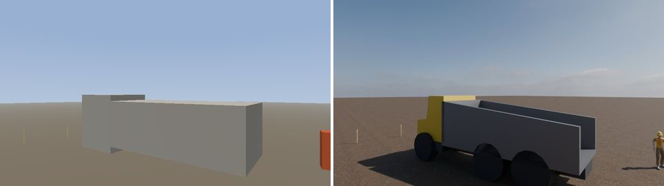
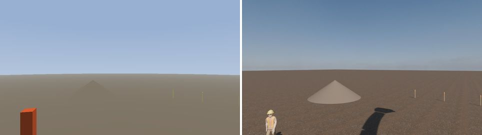
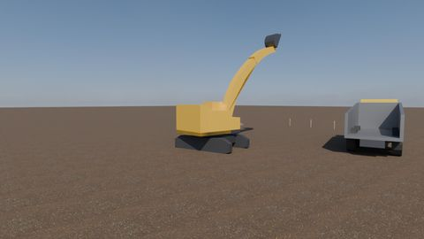

# Rendering: one mesh set, two sensors

sitegen used to draw every actor as an oriented cuboid, and one raycaster
produced both the LiDAR sweep and the camera image. That bought a real
property — *a return in the cloud and a pixel in the image describe the same
surface, because the same ray produced both* — and it cost something the
[worker probe](PROBE-WORKER.md) finally put a number on: an open-vocabulary
detector never once found a worker, because an orange cuboid is not a person.
The probe's ablation is the load-bearing part. Same Cycles, same HDRI, same
gravel, worker still a box: nothing detected. **What the detector could not see
was the box, not the scene.**

So the actors are meshes now, and *both* sensors see them.

| | before | now |
| --- | --- | --- |
| actor geometry | oriented cuboids | triangle meshes, one per rigid link |
| LiDAR | analytic slab test per box | embree BVH over the posed triangles |
| camera | flat albedo, one directional light | Cycles, HDRI, PBR materials |
| `/ground_truth/actors` | the hand-written cuboid | tight box of the posed mesh |
| `/ground_truth/points` | which box the ray hit | which mesh the ray hit |
| `/ground_truth/camera_instances` | which box the ray hit | Cycles, one sample, id per pixel |

Both paths are still selectable — `--actors boxes` and `--camera-renderer
raycast` — and `--actors boxes` is byte-identical to the old renderer, which is
checked rather than asserted: the same seed produces the same MCAP, SHA and all.

## What each sensor sees

**One definition of the geometry.** `meshes.py` builds each link as vertex and
triangle arrays in the link's own frame. The LiDAR intersects those arrays.
Cycles renders those arrays — they cross into Blender as PLY files written from
the same `Mesh` objects, not as instructions for rebuilding something similar.
There is no `.blend` anywhere in this repository, deliberately: a Blender-only
copy of the geometry is a second definition, and a second definition drifts.

**Kinematics did not move.** The excavator is still base → swing → boom → stick
→ bucket, and the same joint angles place the same frames. Only what hangs off
each frame changed.

**The ground-truth cuboid is derived, not declared.** Each link's box is the
tight bounding box of its posed mesh, in the link's own axes. That keeps the
oracle describing what the sensors actually saw, and it fixed a bug nobody had
noticed: the haul truck's cuboids started at z = 0.6 m and z = 1.0 m, because
the box model had no wheels. An eight-tonne machine was floating, and the
ground truth agreed with it.

**Terrain stayed analytic.** A plane and two cones at the angle of repose are
exact and free where a heightmap mesh would be neither, and Blender builds the
identical plane and 128-gon cones, so the two sensors agree about the ground.
Where they can disagree is a cone's silhouette, and there it does not matter:
ground, pile and sky all carry instance id 0.

**Nothing in the sensor model changed.** 1/r² density, range noise, quadratic
dropout, dust, ego self-returns — all untouched. Which triangle a ray hit is a
different question from how a real sensor mangles the answer, and only the
first one moved.

### What it costs, in returns

The worker is the class that changed, and it changed in the direction that
makes the dataset harder rather than easier. Over one 60 s `--seed 1` run,
600 sweeps, 450 azimuth steps:

| | boxes | meshes |
| --- | ---: | ---: |
| terrain | 78.4% | 78.7% |
| ego self-returns | 15.0% | 15.2% |
| haul trucks | 6.36% | 5.91% |
| **workers (both)** | **0.276%** | **0.140%** |
| grade stakes | 0.028% | 0.023% |
| median points on a worker at 13–15 m | 23 | **11** |
| median points on a truck at 10–20 m | 789 | 798 |

A person is not a 0.6 × 0.45 m cuboid, and half the returns the old worker
collected were returns off a box the person does not fill. The truck, which
fills its boxes, is unmoved. The class imbalance the README describes got
about twice as severe, which is the honest number.

## The same-surface test

The old claim was true by construction: one raycaster, so one answer. With
Cycles it is a claim about two renderers agreeing on intrinsics, extrinsics and
two different optical conventions — and that is a measurement, not a property
of the code structure.

`tests/test_same_surface.py` takes LiDAR returns out of a recording, projects
each into every camera using nothing but what the recording publishes (`K` from
the calibration topic, pose from `/tf`), and asks the held-out instance mask
what is at that pixel. It must be the same actor. A 1-pixel neighbourhood is
allowed, because range noise moves a return a few centimetres along the ray and
at a silhouette a few centimetres is the difference between the truck and the
sky behind it.

```
same-surface agreement 0.9984 over 28317 returns
  front_left 0.9941 (7442)  front_right 1.0000 (7319)
  left 1.0000 (6827)        right 1.0000 (6729)
```

Three of the four cameras agree exactly. `front_left` is the one pointed at the
truck and the worker, so it is the one with silhouettes in it, and 0.6% of its
returns land on the far side of an edge — parallax between a LiDAR on the mast
and a camera at the house corner, plus the noise on the return itself. The
threshold is 99% and it is not there to be lowered: a failure means the camera
pose in `/tf` is not the pose Cycles rendered from, or `K` is not the lens
Blender used, or the optical-frame flip was applied twice. Each of those
quietly poisons any camera-to-3D association built on the data.

## The assets

Full provenance in [`src/sitegen/assets/CREDITS`](../src/sitegen/assets/CREDITS).

**The worker is the only downloaded mesh**: Quaternius's CC0 "Worker", rigged,
in a hi-vis vest and hard hat, baked to static triangles in two poses by
`tools/bake_worker.py` — `Idle` for the spotter who holds station and `Walk`
for the one crossing the swing radius, scaled to the 1.75 m box it replaces and
stood on z = 0 facing +x. Baking rather than shipping the GLB is what lets the
LiDAR intersect a person without a skinning implementation, and guarantees
Cycles renders the identical triangles.

**Everything else is procedural**, built from extruded convex profiles: both
excavator ends, the boom chain, a bucket with teeth, both units of the hauler
with six wheels, the grade stakes. That is a deviation from the plan, and the
reason is that the two preferred sources do not exist:

- **3D-ConHE** is not obtainable. The paper's Data Availability Statement gives
  exactly one address, a `rb.gy` shortlink, and it sits behind a Cloudflare bot
  challenge that a headless session cannot pass; mdpi.com itself refuses the
  same requests. There is no Zenodo, GitHub, Kaggle or Hugging Face mirror to
  fall back on. It would also have needed surface reconstruction first — the
  dataset is point clouds of diecast scale models, not meshes.
- **No CC0 excavator or dump truck could be found.** poly.pizza has no model
  tagged excavator, digger or backhoe at all; Quaternius ships no construction
  pack; Poly Haven's model library has none. The nearest hits — several
  bulldozers and two dump trucks — are CC-BY rather than CC0, and both dump
  trucks are single fused meshes with no separable bed, which the per-link
  ground-truth contract needs.

Procedural was the fallback the plan named for exactly this case, and it turns
out to buy something the downloads would not have: the excavator is genuinely
articulated, five separate meshes posed by the five joint frames, so the bucket
box is the bucket rather than a slice of a fused machine.

## Running it

The Cycles path needs three CC0 files that are not vendored (15 MB of texture
would double the repository):

```sh
mkdir -p assets && cd assets
curl -O https://dl.polyhaven.org/file/ph-assets/HDRIs/hdr/2k/kloofendal_43d_clear_puresky_2k.hdr
for m in diff rough nor_gl; do
    curl -O https://dl.polyhaven.org/file/ph-assets/Textures/jpg/2k/gravel/gravel_${m}_2k.jpg
done
```

```sh
uv run sitegen generate --out site.mcap --seed 1 --duration 60 \
    --camera-hz 2 --camera-assets assets
```

```
--actors meshes|boxes            geometry both sensors see (default meshes)
--camera-renderer cycles|raycast default cycles when --camera-hz is set
--camera-assets DIR              where the HDRI and gravel live
--camera-samples N               image samples; the id pass is always 1
```

**Timings**, on an M-series Mac, `--seed 1 --duration 60` at defaults:

| | |
| --- | --- |
| LiDAR, boxes, 600 sweeps | 4.97 s |
| LiDAR, meshes, 600 sweeps | 9.27 s |
| camera, 4 × 2 Hz × 60 s = 480 Cycles frames | 20 min (2.5 s per frame, image + id pass) |

Ray–mesh costs 1.9× ray–box for the whole scene, which is the entire price of
the geometry change on the LiDAR side: about 11 000 triangles go under one
embree BVH per frame, rebuilt from scratch each time so that occlusion between
actors stays a single query.

### Why Blender is a subprocess

`bpy` 5.2.1 is built for CPython 3.13 and the project runs on 3.14, so it
cannot be a dependency without a renderer choosing the interpreter every other
module is written against. `cycles.py` instead writes a job — JSON plus PLY
meshes — and runs `uv run --isolated --no-project --python 3.13 --with bpy` on
it. One Blender process builds the site once and walks every shot, because
starting an interpreter and loading an HDRI per image would cost more than the
images do.

Open3D was the other candidate for the LiDAR side and has no wheels for 3.13 or
3.14; trimesh with `embreex` installs cleanly and casts a 14 400-ray sweep in
about 5 ms.

### Deviations from the plan

- **Instance ids are not the object-index render pass.** Blender 5.2 ships a
  rewritten compositor: the node tree is a node *group*, Render Layers exposes
  only Image and Alpha, and File Output has no `file_slots`, so routing IndexOB
  out of it is neither stable nor obvious. What replaces it needs no compositor:
  a black world, every visible surface overridden by an emission shader carrying
  `id / 255`, one sample, pixel filter collapsed, straight to a linear EXR. The
  first attempt left the ground shaded, and the actors' own emission bounced off
  it at a few thousandths — which rounds to instance ids 1 to 3, actors nowhere
  near that pixel. Silencing the terrain too fixed it; the masks now contain
  only ids that exist.
- **One sample, no antialiasing, for the id pass.** An object index averaged
  across a pixel's samples is not an object index; it is the mean of two
  unrelated integers, and at every silhouette it would name a third actor. One
  sample at the pixel centre is also exactly where `ray_directions` puts its
  ray, which is what makes the two sensors comparable pixel for pixel.
- **Terrain is not a heightmap mesh**, for the reason above: analytic on one
  side and the identical primitives on the other is both cheaper and more
  exactly agreed.
- **The HDRI changed** from the probe's `construction_yard` to a pure-sky one.
  The probe's own write-up flagged the backdrop's real people and vehicles as
  generating their own detections above the horizon; a clean horizon isolates
  the variable.

## Acceptance: what the detector makes of it now

The probe re-run, on the new default pipeline's own output. `sitegen cameras`
picked the ten views the same way it always does — every distinct one with a
worker over 60 pixels, then the clearest trucks — out of a 60 s `--seed 1`
recording. The baseline column is the *same ten views* re-rendered with
`--actors boxes --camera-renderer raycast`, so this is paired view for view
rather than measured against a table from a different ten frames. Same weights,
same prompt, same 0.35 threshold; a score counts only if its box overlaps that
actor's held-out instance pixels at IoU ≥ 0.1.

| view | actor | px | range | boxes + raycast | meshes + Cycles | label |
| --- | --- | ---: | ---: | ---: | ---: | --- |
| front_right t=6.5 | worker_0 | 1884 | 12.9 m | -- | **0.649** | worker |
| front_right t=6.5 | truck_a | 98870 | 9.6 m | 0.430 | **0.704** | haul truck |
| front_right t=9.5 | worker_0 | 2241 | 12.8 m | -- | **0.657** | person |
| front_right t=9.5 | truck_a | 99005 | 9.5 m | 0.370 | **0.704** | haul truck |
| right t=10.0 | worker_0 | 1961 | 13.3 m | -- | **0.697** | person |
| front_left t=11.5 | worker_0 | 2139 | 12.8 m | -- | **0.648** | worker |
| front_left t=11.5 | truck_a | 99868 | 9.6 m | 0.443 | **0.689** | haul truck |
| front_left t=21.5 | worker_1 | 1878 | 13.8 m | -- | **0.648** | person |
| front_left t=24.0 | worker_1 | 3318 | 8.0 m | 0.352 | **0.655** | person |
| left t=24.0 | worker_1 | 3600 | 8.6 m | (0.264) | **0.678** | person |
| front_right t=24.5 | worker_0 | 2461 | 12.8 m | -- | **0.653** | worker |
| front_right t=24.5 | truck_a | 99005 | 9.5 m | 0.371 | **0.710** | haul truck |
| front_left t=27.0 | worker_0 | 2196 | 13.2 m | -- | **0.682** | person |
| front_left t=27.0 | truck_a | 95149 | 9.8 m | 0.372 | **0.686** | haul truck |
| front_right t=30.0 | worker_1 | 2879 | 8.1 m | -- | **0.711** | person |
| front_right t=30.0 | worker_0 | 391 | 16.2 m | -- | **0.585** | person |

| | boxes + raycast | meshes + Cycles |
| --- | --- | --- |
| **worker**, 11 sightings | 1 of 11, best 0.352 | **11 of 11**, 0.585–0.711, mean 0.660 |
| **haul truck**, 5 sightings | 5 of 5, 0.370–0.443, mean 0.397 | **5 of 5**, 0.686–0.710, mean 0.699 |

Both classes cleared the bar. The worker matches the probe and beats it — 0.660
against the probe's 0.544, on a mid-poly human under a cleaner sky. The truck
did not merely hold at its 0.32–0.50 box baseline, it went to **0.70**, which
is within a hundredth of the `haul truck` **0.771** the same weights score on a
real construction photograph. The thing that moved is the wheels: the box truck
was two floating cuboids and the mesh truck is a vehicle.




### The excavator could not be tested on the rig, and here is why

The plan expected the excavator to become detectable from a corner camera.
It cannot be, and the reason is a fact about the rig rather than about the
mesh: **across all 480 instance masks in the recording, the ego machine
occupies exactly 0 pixels.** The cameras ride the house and look outward; the
README's "0.0% ego occlusion, everywhere", previously measured at seven swing
angles, holds at 480 frames. There is one excavator on this site and it is the
one carrying the cameras, so no camera in the rig can see an excavator.

What *does* appear is worth recording as a cost. In five of the ten views the
detector puts a second box on the haul truck and labels it `excavator`, at
0.442–0.486, overlapping the truck's own pixels at IoU 0.97–0.98. Argmax still
picks correctly — `haul truck` scores 0.69–0.71 on the same box — but a naming
pipeline consuming raw detections now has two confident machine labels on one
object where the box renderer gave it one uncertain label.

So the mesh was asked the question a different way: four views from a camera
*off* the machine, looking at it, same renderer and prompt.

| view | detection |
| --- | --- |
| 18 m, three-quarter front, boom raised | `excavator` **0.807** |
| 17 m, rear three-quarter | `excavator` **0.809** |
| 17 m, from behind the truck, boom low | `haul truck` 0.411, `excavator` 0.368 |
| 20 m, second dig station | `excavator haul truck` 0.700 |



0.807 and 0.809 against **0.858** for a real excavator in a photograph. The
mesh is recognisable as an excavator; the surround rig is simply not a place
from which to see one. Making that measurable on the rig itself would need a
second machine on the site, which is a scene change rather than a rendering
one.
